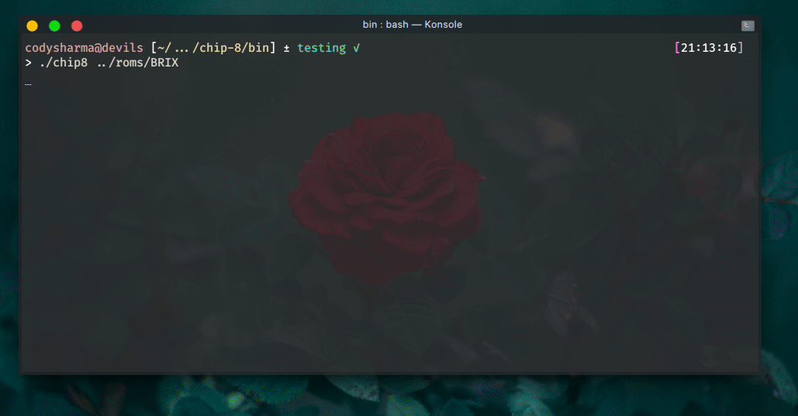
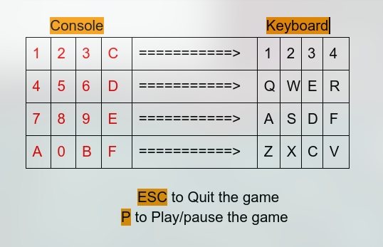
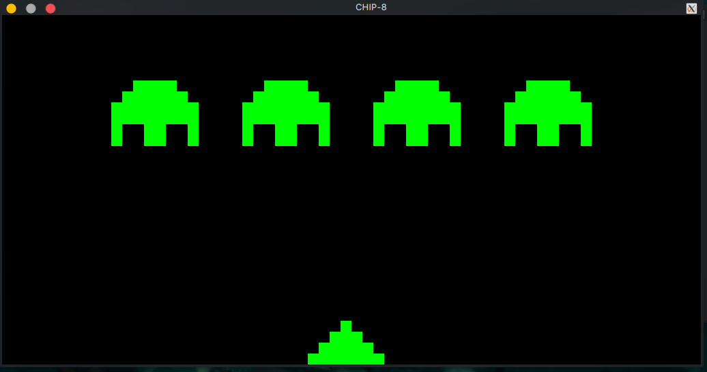
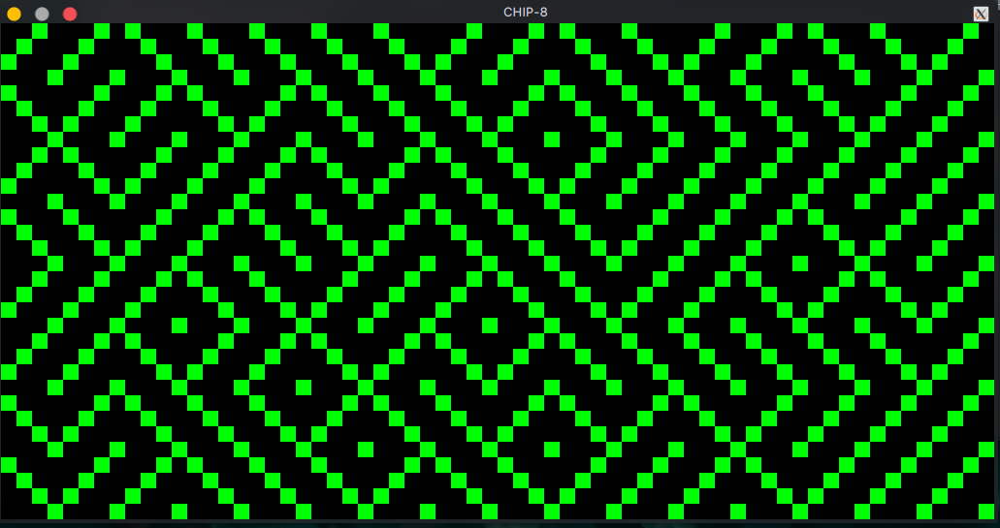
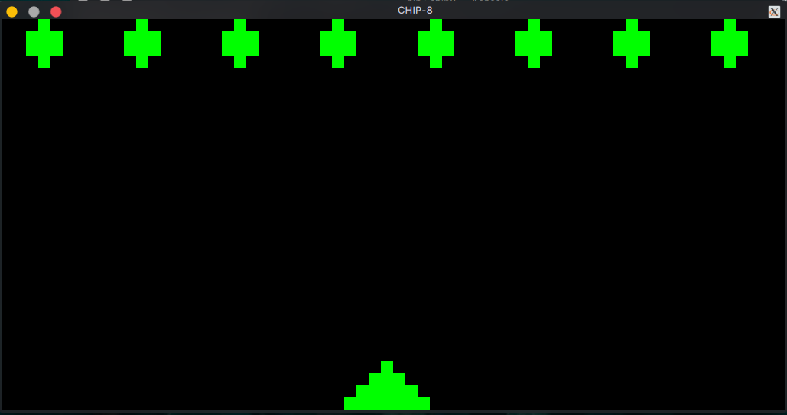
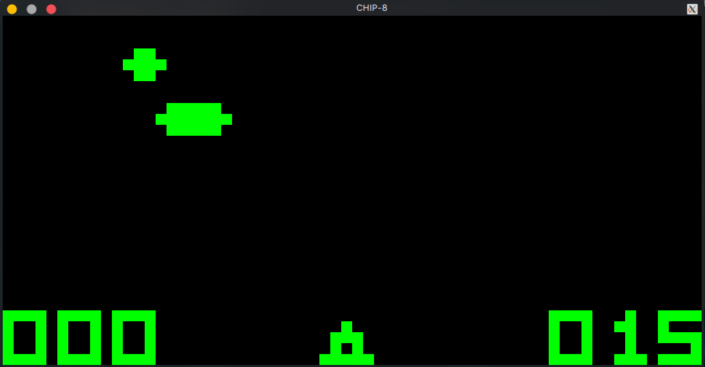

<h1 align="center">
  Chip-8 Emulator
   
</h1>

<h4 align="center">Emulation for a 1970s gaming console coded in C and SDL2 library.</h4>

### Introduction
A Simple Emulator Progaram which can run [CHIP-8](https://en.wikipedia.org/wiki/CHIP-8) [Games](https://github.com/shnupta/Chip-Emul8/tree/master/c8games) on Windows, Linux, and Mac.

<h4 align="center"><i>BRIX Game running on my Linux box.</i></h4>

### Installaion
I added Windows and Linux precompiled binaries in bin folder so you can skip compilation
#### Arch-Linux
$ `sudo pacman -S sdl2 make`
#### Debian
$ `sudo apt-get install libsdl2-dev make`
#### Cent-os
$ `sudo yum install SDL2-devel make`
#### Mac OS
$ `brew install make sdl2`
### Get a copy of repo and compile
$ `git clone https://github.com/c0dysharma/chip8-interpreter.git`

$ `make`

### Usage
#### Unix based
`cd` into to `chip8-interpreter/bin/`
$ `./chip8 <path-to-rom-file>`

  *ex- ./chip8 ../roms/BRIX*

#### Windows
Go to `chip8-interpreter/bin/` hold down `shift` and `right click` on window area and select `Open Command Window Here`

> `chip8win.exe <path-to-rom-file>`

  *ex- chip8win.exe ..\roms\BRIX*
  
 ### Control Maps

### Game Examples
Space INVADERS

Maze

Missile

UFO

### Todos
`TODO: add debugger`

`TODO: add beep sound`

`TODO: optimise code`

### Refernces
[0] https://en.wikipedia.org/wiki/CHIP-8

[1] http://www.multigesture.net/articles/how-to-write-an-emulator-chip-8-interpreter/

[2] https://www.reddit.com/r/emudev

[3] http://devernay.free.fr/hacks/chip8/C8TECH10.HTM#2.2

